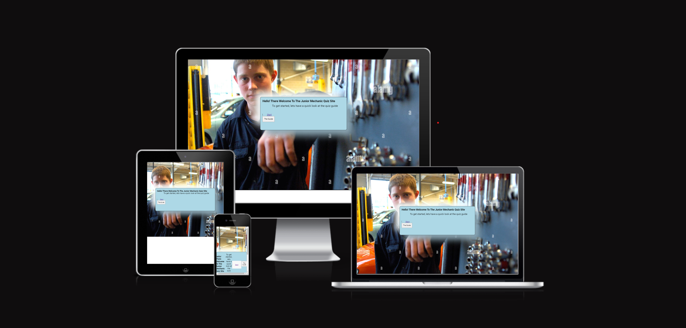
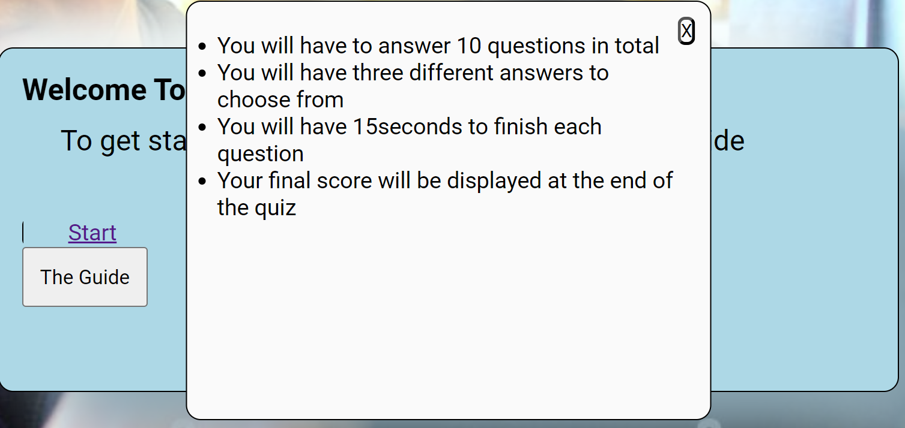

# JUNIOR MECHANIC QUIZ

This is a simple quiz website to test children on the basic knowledge they have about the tools in a mechanical workplace.

The user will get to know the basic mechanical tools and their uses after answering the question.

## Features
 ### The Welcome page
   * This is the first page on the website which displays a welcome messge and a direction on where to start from.
   * This page aslo displays the start link and the button to read the quiz guide from

  ### The Guide
  
  

  ### The Quiz page
   ### Quiz Title
   * This part of the web page spells out the quiz name and a time to the top right hand corner.

   ### Quiz Questions 
   * This part of the quiz display questions with three optional answers to select one from. 
   * The time starts to read down when you start each question.
   * Once you select the correct answer, that button will paint green telling you that the answer is correct.
   * If you select a wrong answer, the button will show orange indicating a wrong answer.
   * You move on to the next question with the Next button.

 ### Score
  * The score for the page user will be declared at the and of the page.
  * If the user is not satisfied and would want to take the quiz again there is a play again button to start again at the end of the quiz.

   