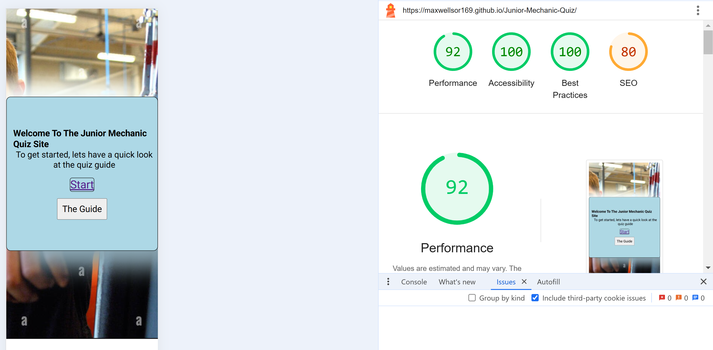
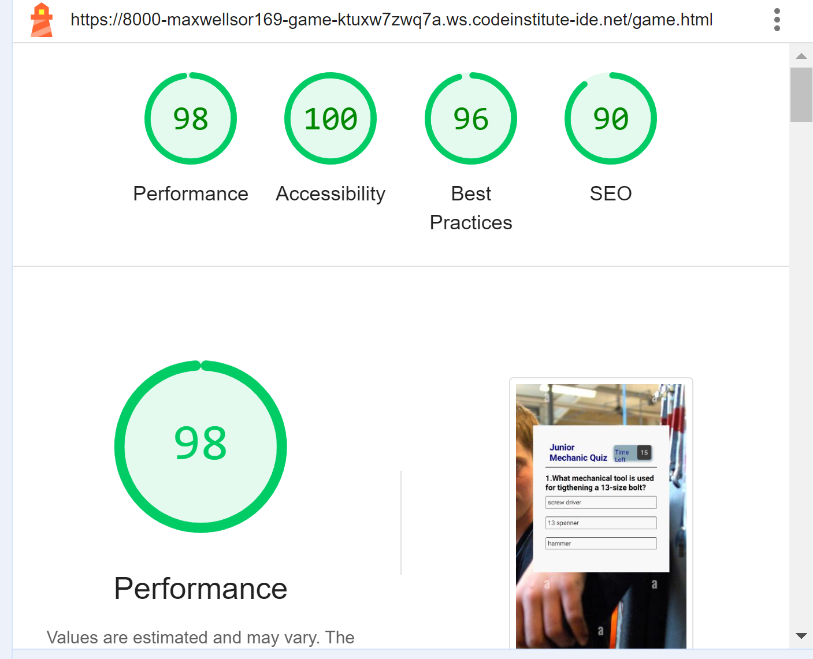

# JUNIOR MECHANIC QUIZ

This is a simple quiz website to test children on the basic knowledge they have about the tools in a mechanical workplace.

The user will get to know the basic mechanical tools and their uses after answering the question.

## Features
 ### The Welcome page
   * This is the first page on the website which displays a welcome messge and a direction on where to start from.
   * This page aslo displays the start link and the button to read the quiz guide from.

  ### The Guide
  
  

  ### The Quiz page
   ### Quiz Title
   * This part of the web page spells out the quiz name and a time to the top right hand corner.

   ### Quiz Questions 
   * This part of the quiz display questions with three optional answers to select one from. 
   * The time starts to read down when you start each question.
   * Once you select the correct answer, that button will paint green telling you that the answer is correct.
   * If you select a wrong answer, the button will show orange indicating a wrong answer.
   * You move on to the next question with the Next button.

 ### Score
  * The score for the page user will be declared at the and of the page.
  * If the user is not satisfied and would want to take the quiz again there is a play again button to start again at the end of the quiz.

  

## Testing on browsers
  * The quiz have been tested on Moxila Firefox, MicrosoftEdge and Google Chrome. 
  * The quiz was also tested on an android phone. 

### Validator Testing
### HTML
 * Index.html
   * Validation done and found no errors on [W3C VALIDATOR](https://validator.w3.org/nu/#textarea)

 * Game.html 
   * Validation done and found no errors on [W3C VALIDATOR](https://validator.w3.org/nu/#textarea)

### CSS 
  * No errors found, but a warning for the font family [Jigsaw Validator](https://jigsaw.w3.org/css-validator/validator)

  

### Java Script
  * Testing done on java found no error with [Jshint Validator](https://jshint.com/)

  

### Bugs
  * Some bug was identified with the Java script file which was obstracting the display of the quiz guide but was figured out and fixed.
  * The timer was noted running at the start of the quiz, so the java script code for index HTML has been copied into a separate File.
  * A code has been added to display the next question at zero countdown of the timer.

### Ligthhouse Results
  * Index.html

  * Game.html

  

### Deployment
  * This site has been deployed on git hub according to the following steps:
    * Select the undeployed github-pages link.
    * Select settings from the buttons displayed on top of the page.
    * Select pages from the pop up list on the left hand side of the page.
    * Go to the Build and Deployment section on the new page.
    * Select main under Branch.
    * Select root and save.
    * Refresh page and site is deployed.
    * The current live deployed page is [Junior-Mechanic-Quiz](https://maxwellsor169.github.io/Junior-Mechanic-Quiz/)

### Manual Testing
| Action | Expected Results | Results |
|--- | --- | --- |
|Click the guide button|A pop-up displays the quiz guide| The guide window is displayed |
| Click the guide closing button | This will close the pop up guide window | The guide window disappers |
| Select the start link | This will open the page for the quiz | Quiz begins |
| Select an answer button | The selected button change colour to green or orange | An answer is selected |
| Click on next | This displays the next question page | A fresh question is displayed |
| Click play again button | This restart the quiz again | Quiz starts again |

### Features Left
  * The return button to the welcome page.
  * The feature to display the correct answer when the one selected is wrong.

### Languages
  * HTML
  * Java Script
  * Css

### Credit
* Content
  * 1st Youtube tutorial video (https://www.youtube.com/watch?v=PBcqGxrr9g8&t=179s)
  * 2nd Youtube tutorial video (https://www.youtube.com/watch?v=WUBhpSRS_fk&t=2469s)
  * Sample project guide from (https://github.com/Patteerrik/sports-quiz/)

* Media  
  * [Favicon.io](https://favicon.io/) which I used to create the favicons.
  * All the images used were taken from an open source site. 

* Final credit is to my mentor (Mr. Gareth McGirr) who gave me the confidence that I can do it.  

|

   